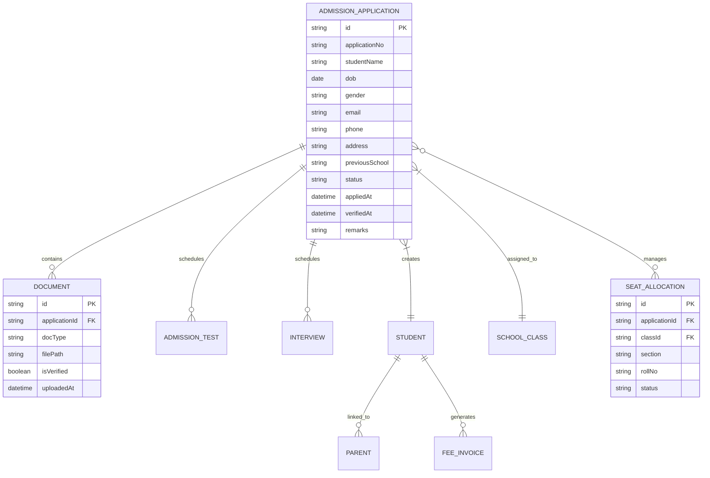

# Admission Management Module Specification

## 1. Purpose
Manage the complete student admission lifecycle from initial inquiry through enrollment, ID generation, and parent onboarding. Support both online and walk-in admissions with automated workflows and reporting.

## 2. Scope
This module handles all admission-related activities including application processing, document verification, seat allocation, approval workflows, and post-admission activities such as parent account creation and fee generation.

## 3. Features
- Online admission application with document upload
- Walk-in admission processing
- Admission inquiry management
- Prospect tracking and follow-up
- Automated admission workflow with status tracking
- Document verification and validation
- Seat allocation and class assignment
- Admission approval/rejection management
- Student ID and roll number generation
- Parent account creation with credentials
- Automatic fee structure generation
- Admission reports and analytics
- Waiting list management
- Admission test scheduling and evaluation
- Interview scheduling and documentation

## 4. User Flows

### Admissions Officer
1. Review new applications in queue
2. Verify uploaded documents
3. Schedule admission test/interview if required
4. Evaluate test/interview results
5. Assign seat/class or place on waiting list
6. Approve or reject admission
7. Generate student ID and roll number
8. Create parent portal credentials
9. Generate initial fee invoice
10. Generate admission reports

### Parent/Guardian (Online)
1. Access admission portal
2. Fill online application form
3. Upload required documents
4. Pay application fee (if applicable)
5. Track application status
6. Attend scheduled test/interview
7. Receive admission decision
8. Complete enrollment formalities

### Student
1. Receive admission confirmation
2. Access parent portal with provided credentials
3. View admission details and fee status

## 5. Business Rules
- Application ID generated as `ADM-{YEAR}-{SEQUENCE}` (e.g., ADM-2024-00123)
- Student ID format: `{SCHOOL_CODE}-{CLASS}-{SEQUENCE}` (e.g., RMS-10-A-0456)
- Roll numbers assigned per class per academic year
- Applications received after deadline placed on waiting list
- Minimum age for admission: 3 years
- Maximum class size: 45 students (configurable per school)
- Seat allocation follows seniority: previous class performance > random selection
- Documents must be verified within 48 hours of application
- Parent account created within 24 hours of approval
- Fee invoice generated immediately upon approval
- Rejection notifications sent within 24 hours
- Waiting list moves to active if seats become available before admission deadline

## 6. Validation Rules
- Application form must have all mandatory fields marked
- Age must be between 3 and 25 years
- Email must be unique and valid format
- Phone number must be 10 digits
- Date of birth cannot be future date
- Documents must be PDF/JPG/PNG, max 5MB each
- Previous school name required if transferring
- Emergency contact details mandatory
- Caste/category selection required for Indian schools
- Photo must be 200x200 to 400x400 pixels

## 7. Database Entities (Conceptual)

## 8. API Endpoints

| Method | Path | Auth | Description |
|--------|------|------|-------------|
| POST | `/api/v1/admissions/applications` | ✅ (Admissions) | Submit new application |
| GET | `/api/v1/admissions/applications` | ✅ (Admissions) | List applications with filters |
| GET | `/api/v1/admissions/applications/:id` | ✅ (Admissions) | Get application details |
| PUT | `/api/v1/admissions/applications/:id` | ✅ (Admissions) | Update application status |
| POST | `/api/v1/admissions/documents/verify` | ✅ (Admissions) | Verify uploaded documents |
| POST | `/api/v1/admissions/schedule-test` | ✅ (Admissions) | Schedule admission test |
| POST | `/api/v1/admissions/schedule-interview` | ✅ (Admissions) | Schedule interview |
| POST | `/api/v1/admissions/seat-allocate` | ✅ (Admissions) | Allocate seat to student |
| POST | `/api/v1/admissions/approve/:id` | ✅ (Principal/Admin) | Approve admission |
| POST | `/api/v1/admissions/reject/:id` | ✅ (Principal/Admin) | Reject admission |
| POST | `/api/v1/admissions/waiting-list` | ✅ (Admissions) | Add to waiting list |
| POST | `/api/v1/admissions/generate-id` | ✅ (Admissions) | Generate student ID |
| POST | `/api/v1/admissions/create-parent-account` | ✅ (Admissions) | Create parent portal account |
| GET | `/api/v1/admissions/reports/summary` | ✅ (Admin) | Admission summary report |
| GET | `/api/v1/admissions/reports/waiting-list` | ✅ (Admin) | Waiting list report |

## 9. Permissions

| Role | View Applications | Process Apps | Approve | Reject | Generate ID | Parent Account | Reports |
|------|-------------------|--------------|---------|--------|-------------|----------------|---------|
| Super Admin | ✅ | ✅ | ✅ | ✅ | ✅ | ✅ | ✅ |
| Principal | ✅ | ✅ | ✅ | ✅ | ✅ | ✅ | ✅ |
| Admissions Officer | ✅ | ✅ | ❌ | ❌ | ❌ | ❌ | ✅ |
| Accountant | ✅ | ❌ | ❌ | ❌ | ❌ | ❌ | ✅ |

## 10. Notifications
- **Application Received**: Email/SMS acknowledgment to parent
- **Document Verification**: Status update notification
- **Test/Interview Scheduled**: Calendar invite + SMS
- **Admission Decision**: Approval/rejection notification with next steps
- **Waiting List**: Position update (monthly)
- **ID Generated**: SMS with student ID
- **Parent Account Created**: Login credentials via email
- **Fee Invoice Generated**: Email with invoice link

## 11. Reports
- **Daily Application Summary**: Applications received per day
- **Document Verification Report**: Pending verifications
- **Seat Allocation Report**: Class-wise seat status
- **Admission Test Results**: Merit-based ranking
- **Waiting List Report**: Current position and movement
- **Monthly Admission Report**: Trend analysis
- **Source-wise Applications**: Enquiries vs direct applications
- **Rejection Analysis**: Reasons for rejection

## 12. Edge Cases
- **Duplicate Application**: Same student applying twice → Flag and merge option
- **Capacity Full**: Class at capacity → Auto-place on waiting list
- **Document Rejection**: Invalid documents → Request re-upload with 48-hour window
- **Test Absence**: Student absent for test → Reschedule or reject
- **Multiple Guardians**: Two parents → Create primary guardian with linked secondary
- **No Interview Slot**: All slots filled → Auto-schedule next available
- **Technical Failure**: Portal crash during upload → Resume from last step

## 13. Security Considerations
- File uploads scanned for malware
- Application data encrypted at rest
- Parent portal credentials sent via secure channel
- Admin access logged for audit trail
- Rate limiting on application submission (5 per hour per IP)
- CAPTCHA on public application forms

## 14. Performance Considerations
- Document processing: Asynchronous background jobs
- Report generation: Cached for 1 hour with manual refresh option
- Search indexing: Elasticsearch for application search
- Batch processing: Bulk document verification (max 100/day)
- API response time: < 500ms for reads, < 1000ms for writes

## 15. Future Enhancements
- AI-based document verification
- Video interview integration
- Multi-language form support
- Mobile app for application tracking
- Blockchain-based certificate issuance
- Integration with passport/seal verification services

## 16. Cross References
- **Constitution**: RBAC (Section 7), Multi-Tenant (Section 1)
- **Student Management Spec**: Post-admission student record creation
- **Parent Management Spec**: Parent account linking
- **Fee Management Spec**: Invoice generation workflow
- **Notification System Spec**: Alert templates
- **File Storage System Spec**: Document storage architecture