# Entity Relationship Diagram (Enterprise SaaS School ERP)

```mermaid
erDiagram

    SCHOOL ||--o{ USER : has
    SCHOOL ||--o{ STUDENT : enrolls
    SCHOOL ||--o{ EMPLOYEE : employs
    SCHOOL ||--o{ TEACHER : employs
    SCHOOL ||--o{ PARENT : registers
    SCHOOL ||--o{ ACADEMIC_SESSION : manages
    SCHOOL ||--o{ GRADE : contains
    SCHOOL ||--o{ SECTION : contains
    SCHOOL ||--o{ SUBJECT : offers
    SCHOOL ||--o{ CLASSROOM : owns
    SCHOOL ||--o{ FEE_STRUCTURE : defines
    SCHOOL ||--o{ TRANSPORT_ROUTE : manages
    SCHOOL ||--o{ LIBRARY_BOOK : owns
    SCHOOL ||--o{ INVENTORY_ITEM : owns
    SCHOOL ||--o{ NOTIFICATION : sends
    SCHOOL ||--o{ AUDIT_LOG : stores

    USER ||--o{ ROLE_ASSIGNMENT : has
    ROLE_ASSIGNMENT }o--|| ROLE : assigned

    PARENT ||--o{ STUDENT_PARENT : linked
    STUDENT ||--o{ STUDENT_PARENT : linked

    GRADE ||--o{ SECTION : contains

    SECTION ||--o{ ENROLLMENT : accepts
    STUDENT ||--o{ ENROLLMENT : enrolled

    ACADEMIC_SESSION ||--o{ ENROLLMENT : belongs_to

    SUBJECT ||--o{ TEACHER_SUBJECT : assigned
    TEACHER ||--o{ TEACHER_SUBJECT : teaches

    SECTION ||--o{ TIMETABLE : schedules
    SUBJECT ||--o{ TIMETABLE : scheduled
    TEACHER ||--o{ TIMETABLE : teaches
    CLASSROOM ||--o{ TIMETABLE : allocated

    STUDENT ||--o{ ATTENDANCE : has
    TEACHER ||--o{ ATTENDANCE : marks

    SUBJECT ||--o{ EXAM : contains
    SECTION ||--o{ EXAM : conducts
    TEACHER ||--o{ EXAM : creates

    EXAM ||--o{ GRADE_RECORD : produces
    STUDENT ||--o{ GRADE_RECORD : receives

    STUDENT ||--o{ FEE_INVOICE : billed
    FEE_STRUCTURE ||--o{ FEE_INVOICE : generates
    FEE_INVOICE ||--o{ PAYMENT : paid_by

    STUDENT ||--o{ TRANSPORT_ASSIGNMENT : assigned
    TRANSPORT_ROUTE ||--o{ TRANSPORT_ASSIGNMENT : contains

    STUDENT ||--o{ BOOK_ISSUE : borrows
    LIBRARY_BOOK ||--o{ BOOK_ISSUE : issued

    EMPLOYEE ||--o{ LEAVE_REQUEST : requests
    EMPLOYEE ||--o{ PAYROLL : receives

    INVENTORY_ITEM ||--o{ INVENTORY_TRANSACTION : tracked

    USER ||--o{ NOTIFICATION : receives

    USER ||--o{ AUDIT_LOG : performs
```

---

# Global Database Standards

Every table MUST contain:

- `id`
- `schoolId`
- `createdAt`
- `updatedAt`
- `deletedAt` (Soft Delete)

---

# Core Entities

### School
Master tenant table.

### User
Authentication identity.

### Role
Permission role.

### RoleAssignment
Maps Users to Roles.

### Student
Student master record.

### Parent
Parent / Guardian master.

### StudentParent
Many-to-many relationship between Parents and Students.

Supports:

- Father
- Mother
- Guardian

One parent can have multiple children.

One student can have multiple guardians.

---

### Employee

Generic employee table.

Examples:

- HR
- Accountant
- Receptionist
- Librarian
- Admin Staff

Teacher is a specialized employee.

---

### Teacher

Teacher-specific profile.

---

### AcademicSession

Examples:

- 2026-2027
- 2027-2028

Every enrollment, fee, attendance and exam belongs to an Academic Session.

---

### Grade

Examples:

- Grade 1
- Grade 2
- Grade 10

---

### Section

Examples:

- Grade 5 - A
- Grade 5 - B
- Grade 5 - C

---

### Enrollment

Stores student's yearly admission.

Instead of directly assigning Student → Section.

Benefits:

- Student promotion
- Transfer
- Repeat year
- Academic history

---

### Subject

Examples:

- English
- Mathematics
- Science
- Urdu
- Computer

---

### TeacherSubject

Maps teachers to subjects.

Example

Ali teaches

- Math
- Physics

---

### Classroom

Physical room.

Examples

Room 101

Lab 1

Computer Lab

---

### Timetable

Connects

- Teacher
- Subject
- Classroom
- Section
- Day
- Time Slot

---

### Attendance

Daily attendance.

Supports

- Student Attendance
- Teacher Attendance
- Staff Attendance

---

### Exam

Supports

- Quiz
- Assignment
- Mid
- Final
- Practical

---

### GradeRecord

Stores marks.

Supports

- GPA
- Percentage
- Position
- Remarks

---

### FeeStructure

Defines

- Admission Fee
- Monthly Fee
- Transport Fee
- Annual Charges
- Examination Fee
- Fine
- Discount

---

### FeeInvoice

Student billing.

---

### Payment

Stores

- Partial Payments
- Full Payments
- Refunds
- Payment Method

---

### TransportRoute

School transport routes.

---

### TransportAssignment

Assigns student to route.

---

### LibraryBook

Book master.

---

### BookIssue

Book borrowing history.

---

### InventoryItem

School assets.

Examples

- Computer
- Chair
- Projector
- Whiteboard

---

### InventoryTransaction

Tracks

- Purchase
- Assignment
- Repair
- Disposal

---

### LeaveRequest

Employee leave requests.

Supports

- Annual Leave
- Casual Leave
- Sick Leave

---

### Payroll

Employee salary.

---

### Notification

Supports

- In-App
- Email
- WhatsApp (Future)
- SMS (Future)

---

### AuditLog

Stores

- Login
- CRUD operations
- Fee Changes
- Attendance Changes
- Grade Changes
- Settings Changes

Immutable.

Append Only.

---

# Relationship Summary

- One School → Many Users
- One School → Many Students
- One School → Many Teachers
- One School → Many Parents
- One School → Many Employees
- One Grade → Many Sections
- One Section → Many Students (through Enrollment)
- One Student → Many Attendance Records
- One Student → Many Fee Invoices
- One Student → Many Payments
- One Student → Many Exams
- One Teacher → Many Subjects
- One Teacher → Many Timetable Entries
- One Parent → Multiple Children
- One Child → Multiple Guardians
- One Exam → Many Grades
- One Route → Many Students
- One Book → Many Issue Records
- One Employee → Many Leave Requests
- One Employee → Many Payroll Records
- One User → Many Audit Logs
- One User → Many Notifications

---

# Multi-Tenant Rule

Every query MUST be scoped by `schoolId`.

No tenant can access another tenant's data.

Only **Super Admin** may access multiple schools.

---

# Future Ready

This ERD is designed to support:

- SaaS Multi-Tenant
- Multiple Schools
- Mobile App
- Parent Portal
- Student Portal
- Teacher Portal
- HRMS
- Finance
- Library
- Transport
- Inventory
- Payroll
- AI Analytics
- Learning Management System (LMS)
- Online Classes
- Multi-Campus Expansion