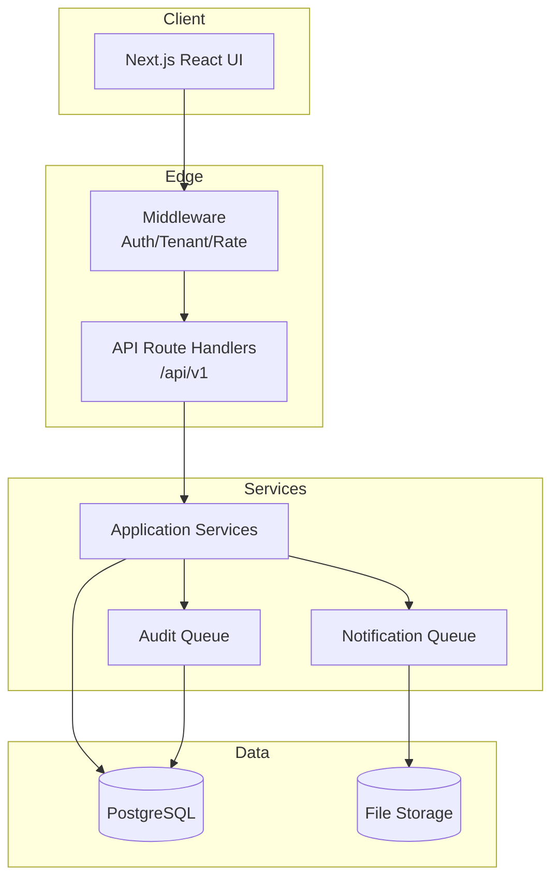

# Implementation Plan

## 1. High-Level Architecture

## 2. Development Workflow
1. **Feature Branch** from `main`.
2. **TDD**: Write tests first (unit/integration).
3. **Implement** against tests.
4. **Lint & Type-Check** pass in CI.
5. **Self-Review** checklist.
6. **Pull Request** with description, screenshots, linked tasks.
7. **Peer Review** (min 1 reviewer).
8. **Merge** after CI green.

## 3. Module Implementation Order
| Module | Dependencies | Estimated Effort |
|--------|--------------|------------------|
| Authentication | None | 1 sprint |
| Authorization/RBAC | Auth | 0.5 sprint |
| Database Schema | None | 1 sprint |
| Student Management | Auth, DB Schema | 1.5 sprints |
| Teacher Management | Auth, DB Schema | 1.5 sprints |
| Attendance | Student, Teacher | 1 sprint |
| Timetable | Student, Teacher, Classes | 2 sprints |
| Examination | Student, Timetable | 2 sprints |
| Grading | Examination | 1.5 sprints |
| Fee Management | Student | 1.5 sprints |
| HR | Auth | 2 sprints |
| Notification | Auth | 1 sprint |
| File Storage | Auth | 1 sprint |
| Audit Logs | Auth | 1 sprint |
| Dashboard | All modules | 1 sprint |
| Public Website | None | 1 sprint |

## 4. Database Migration Strategy
- All changes via `prisma migrate dev`.
- Migrations are additive only; backward compatibility maintained.
- Pre-deployment: `prisma migrate deploy --name timestamp_name`.

## 5. Deployment Checklist
- [ ] All tests pass
- [ ] Security scan clean
- [ ] Environment variables set
- [ ] Seed data loaded
- [ ] Rollback plan verified
- [ ] Stakeholder demoed

## 6. Rollback Plan
- Revert Vercel deployment (instant).
- DB migrations are backward-compatible; if not, restore from snapshot.