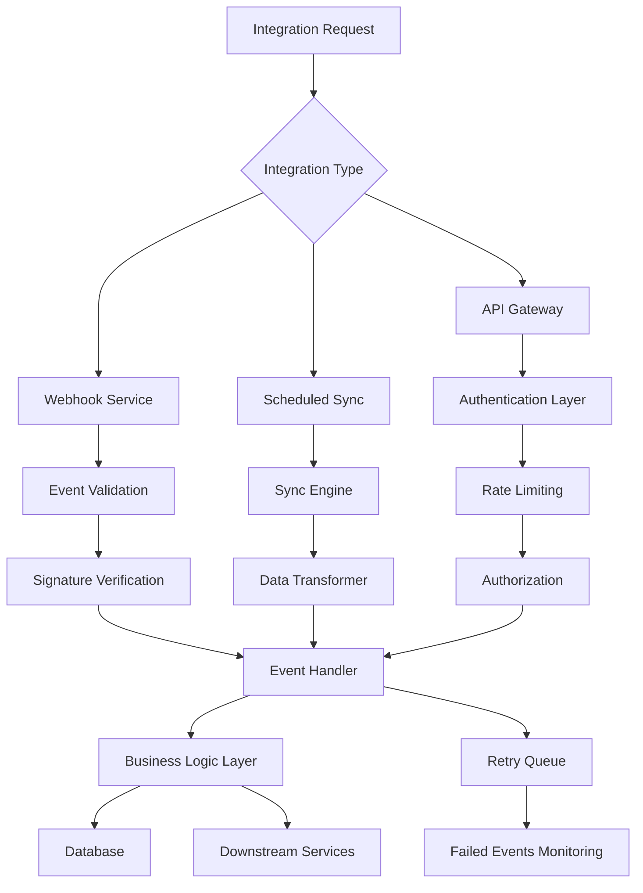

# Integration Specification

## 1. Purpose
Define a comprehensive, extensible integration framework that enables seamless data exchange, functionality extension, and ecosystem interoperability for the School ERP SaaS platform with external services, payment gateways, communication channels, and third-party educational tools.

## 2. Scope
This specification covers all current and future integration capabilities including email services, messaging platforms, payment gateways, calendar systems, authentication providers, data exchange formats, webhooks, and future ERP connector patterns.

## 3. Features
- Standardized webhook event publishing system
- Multi-channel notification integration (Email, SMS, WhatsApp)
- Payment gateway integration with real-time callbacks
- Calendar synchronization (Google Calendar, Outlook)
- Single Sign-On (SSO) and OAuth2 integration
- Bulk data import/export capabilities
- RESTful API for third-party integrations
- File import/export in standard formats
- Real-time status synchronization
- Integration health monitoring and alerting
- API rate limiting and security controls
- Future ERP and LMS integration connectors

## 4. Integration Categories

### 4.1 Communication Integrations
| Integration | Provider | Purpose | Authentication | Features |
|------------|----------|---------|----------------|----------|
| Email | SendGrid/SES | Transactional and bulk emails | API Key | Templates, tracking, bounce handling |
| WhatsApp | Twilio/Meta | Instant messaging notifications | OAuth2/API Key | Templates, media support, read receipts |
| SMS | Twilio/Nexmo | Critical alert messaging | API Key | Unicode support, delivery receipts |
| Push Notifications | Firebase | Mobile app notifications | OAuth2 | Rich notifications, analytics |
| Voice Calling | Twilio/Nexmo | Voice alerts for emergencies | API Key | Call recording, transcription |

### 4.2 Payment Integrations
| Integration | Provider | Purpose | Authentication | Features |
|------------|----------|---------|----------------|----------|
| Credit Card | Stripe | Global card payments | API Key + Webhook | Tokenization, recurring billing |
| Regional Wallet | JazzCash/EasyPaisa | Local wallet payments | API Key + Webhook | QR codes, instant settlement |
| Bank Transfer | Local Bank API | Direct bank transfers | OAuth2/API Key | Mandate setup, retry logic |
| Buy-now-pay-later | Klarna/AfterPay | Installment payments | API Key | Risk assessment, fraud protection |

### 4.3 Calendar and Meeting Integrations
| Integration | Provider | Purpose | Authentication | Features |
|------------|----------|---------|----------------|----------|
| Google Calendar | Google | Calendar sync | OAuth2 | Event creation, reminders |
| Microsoft Outlook | Microsoft | Calendar sync | OAuth2 | Event sync, scheduling |
| Google Meet | Google | Virtual meetings | OAuth2 | Meeting links, recordings |
| Zoom | Zoom | Video conferencing | JWT/API Key | Meetings, recordings, analytics |

### 4.4 Authentication Integrations
| Integration | Provider | Purpose | Authentication | Features |
|------------|----------|---------|----------------|----------|
| SAML SSO | AzureAD, Okta | Enterprise login | SAML Assertion | JIT provisioning, attribute mapping |
| OAuth2 | Google/Microsoft | Social signin | OAuth2 | Profile sync, token refresh |
| LDAP | OpenLDAP | Legacy directory sync | LDAP Bind | Sync intervals, user filters |
| SCIM | Okta/Workday | User lifecycle | OAuth2 Bearer Token | Auto-provisioning, deprovisioning |

### 4.5 Data Exchange Integrations
| Integration | Format | Purpose | Features |
|------------|--------|---------|----------|
| CSV Import/Export | Text/CSV | Bulk student/financial data | Validation, error reporting |
| Excel Import/Export | XLSX | Spreadsheet compatibility | Template-based, formulas preserved |
| REST API | JSON | Real-time data sync | Rate limiting, pagination, filtering |
| GraphQL API | GraphQL | Flexible data querying | Schema introspection, subscriptions |
| iCal Feed | .ics | Calendar subscription | Recurring events, reminders |

## 5. API Endpoints (Integration Control)

| Method | Path | Auth | Description |
|--------|------|------|-------------|
| POST | `/api/v1/integrations/configure` | ✅ (Admin) | Add new integration |
| GET | `/api/v1/integrations/list` | ✅ (Admin) | List all integrations |
| PUT | `/api/v1/integrations/:id` | ✅ (Admin) | Update integration settings |
| DELETE | `/api/v1/integrations/:id` | ✅ (Admin) | Disable integration |
| GET | `/api/v1/integrations/:id/status` | ✅ (Admin) | Check integration health |
| POST | `/api/v1/integrations/test/:id` | ✅ (Admin) | Send test notification |
| POST | `/api/v1/integrations/webhook/:provider` | ❌ (System) | Receive webhook callback |
| GET | `/api/v1/integrations/logs` | ✅ (Admin) | Integration activity logs |
| POST | `/api/v1/import/excel/:entity` | ✅ (Admin) | Import Excel file |
| GET | `/api/v1/export/:entity` | ✅ (Admin) | Export entity data to CSV |
| GET | `/api/v1/health/integrations` | ✅ (System) | All integration statuses |

## 6. Webhook Events Catalog

### 6.1 Student Lifecycle Events
| Event | Payload Fields | Description |
|-------|---------------|-------------|
| `student.created` | studentId, schoolId, classId | New student enrollment |
| `student.updated` | studentId, changedFields | Student record changes |
| `student.deleted` | studentId, deletionReason | Student record removal |
| `enrollment.confirmed` | enrollmentId, studentId, classId | Enrollment finalized |

### 6.2 Attendance Events
| Event | Payload Fields | Description |
|-------|---------------|-------------|
| `attendance.marked` | studentId, date, status | Attendance recorded |
| `attendance.bulk.completed` | classId, date, count | Bulk attendance upload complete |
| `late.arrival` | studentId, minutesLate | Late arrival detected |

### 6.3 Fee Management Events
| Event | Payload Fields | Description |
|-------|---------------|-------------|
| `fee.invoice.generated` | invoiceId, studentId, amount | Invoice created |
| `fee.payment.received` | paymentId, amount, method | Payment successful |
| `fee.due.reminder` | invoiceId, daysOverdue | Due date approaching |
| `fee.overdue.alert` | invoiceId, daysOverdue | Overdue beyond threshold |
| `fee.discount.applied` | discountId, amount, reason | Discount applied |

### 6.4 Examination Events
| Event | Payload Fields | Description |
|-------|---------------|-------------|
| `exam.scheduled` | examId, classId, date | Exam scheduled |
| `exam.results.published` | examId, publishedAt | Results released |
| `grade.updated` | studentId, examId, grade | Grade modified |

### 6.5 HR/Payroll Events
| Event | Payload Fields | Description |
|-------|---------------|-------------|
| `payroll.processed` | payrollId, month, year | Payroll run complete |
| `salary.updated` | employeeId, newAmount | Salary change effective |
| `leave.approved` | leaveId, employeeId | Leave request approved |

### 6.6 System Events
| Event | Payload Fields | Description |
|-------|---------------|-------------|
| `system.backup.completed` | backupId, timestamp | Backup successful |
| `system.maintenance.started` | windowId, startTime | Scheduled maintenance |
| `integration.failure` | provider, error, retry | Integration error occurred |
| `compliance.event.logged` | eventId, type, data | Audit event recorded |

## 6. Webhook Payload Structure
```json
{
  "event": "student.created",
  "timestamp": "2026-06-23T14:30:00Z",
  "tenantId": "school-123",
  "data": {
    "studentId": "STU-123-001",
    "name": "John Doe",
    "email": "john.doe@school.edu",
    "gradeLevel": "10"
  },
  "signature": "sha256-hmac-signature",
  "retries": 0,
  "version": "v1"
}
```

## 7. Security Requirements (Integration)
- **Webhook Integrity**: HMAC-SHA256 signatures for all incoming webhooks
- **Secret Management**: All credentials stored encrypted in AWS Secrets Manager
- **Rate Limiting**: 100 requests/minute per tenant for integration APIs
- **Retry Logic**: Exponential backoff with max 5 retries, 30 sec initial delay
- **Idempotency**: All webhook endpoints idempotent to handle duplicate deliveries
- **IP Whitelisting**: Optional IP allowlist for sensitive integrations
- **Data Encryption**: AES-256 for all stored credentials
- **Audit Logging**: All integration accesses and changes logged with full context
- **Compliance**: FERPA/GDPR adherence for data exchange integrations

## 8. Integration Architecture


## 9. Monitoring and Alerting
- **Integration Health Dashboard**: Real-time status of all configured integrations
- **Delivery Failures**: Alerting on webhook delivery failures
- **Rate Limit Exceeded**: Notification when approaching rate limits
- **Authentication Errors**: Immediate alert on credential validation failures
- **Sync Lag Detection**: Alert when data sync falls behind threshold
- **SLA Monitoring**: Track integration uptime and performance
- **Cost Monitoring**: Budget alerts for integration usage costs
- **Security Alerts**: Suspicious activity detection on integration endpoints

## 10. Future Enhancements
- **GraphQL Subscriptions**: Real-time data push via subscriptions
- **Message Queue Integration**: Kafka/RabbitMQ for high-volume events
- **Blockchain-based Verification**: Immutable audit trail for critical events
- **AI-Powered Routing**: Smart event routing based on historical patterns
- **Multi-cloud Strategy**: Integration across AWS, Azure, GCP ecosystems
- **Serverless Integration Functions**: Lambda functions for lightweight integrations
- **Integration Marketplace**: Community-contributed integration connectors
- **Event Schema Registry**: Centralized schema management for webhook payloads
- **Predictive Integration Monitoring**: Anomaly detection for integration latency
- **Disaster-Aware Routing**: Route integrations through backup paths during outages

## 11. Cross References
- **Constitution**: Security-First (Section 4), Multi-Tenant (Section 1), API Standards (Section 9)
- **Database Standards**: Integration data model and indexing
- **Notification System**: Alert channels and template integration
- **Fee Management Spec**: Payment gateway integration requirements
- **Student Management Spec**: Bulk import/export data structures
- **Authentication Spec**: SSO integration patterns
- **File Storage Spec**: Large file import/export integration
- **Backup-DR Spec**: Integration failover and restore procedures
- **Testing Strategy**: Integration testing patterns and coverage