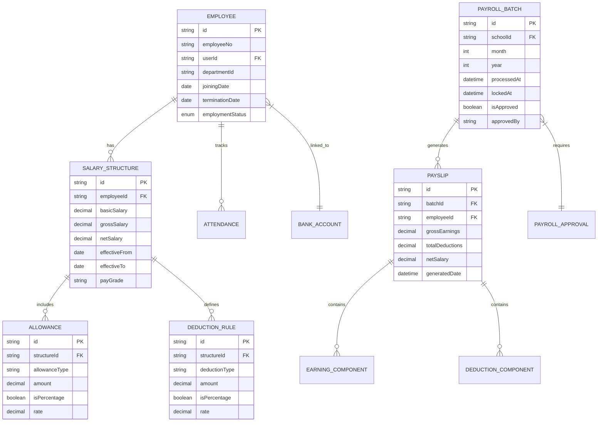

# Payroll Management Module Specification

## 1. Purpose
Manage comprehensive employee compensation including salary structures, allowances, deductions, overtime, bonuses, tax calculations, and payroll processing for all staff categories within the school organization.

## 2. Scope
This module covers the complete payroll lifecycle from salary definition through payslip generation, including statutory compliance (Income Tax, EOBI/Social Security), attendance integration, and financial reporting.

## 3. Features
- Salary structure definition with pay grades
- Allowance management (house rent, medical, conveyance)
- Deduction handling (loan recovery, advances, taxes)
- Overtime calculation and payment
- Bonus and incentive processing
- Income tax computation and deduction
- EOBI/Social Security contributions
- Attendance-linked salary deductions
- Leave encashment processing
- Payslip generation (PDF/email)
- Payroll approval workflow with locking
- Bank payment file generation
- Statutory reporting
- Historical salary tracking

## 4. User Flows

### HR/Admin Flow
1. Define salary structures and pay grades
2. Configure allowances and deductions rules
3. Set up tax brackets and EOBI rates
4. Review monthly payroll data
5. Approve or reject payroll batch
6. Generate bank payment files
7. Distribute payslips to employees
8. Generate statutory reports

### Employee Flow
1. View salary structure
2. Check attendance and overtime
3. View payslip and payment history
4. Download payslip PDF
5. Request salary advances (if permitted)

## 5. Business Rules
- Salary calculations rounded to 2 decimal places
- Payslip generated on last day of month
- Payroll locked 30 days after approval
- Changes require new approval cycle
- Overtime paid at 1.5x hourly rate for weekdays
- Overtime paid at 2x for weekends/holidays
- Maximum 50 hours overtime per month
- EOBI contribution: 5% employer, 5% employee (PK setting)
- Income tax deducted as per applicable tax tables
- Leave deduction: salary / working days * leave days
- Advance recovery: Fixed amount from next 3 payslips
- Bonus payable only in profit-making months
- Salary changes effective next payroll cycle

## 6. Validation Rules
- Net salary must be positive after all deductions
- Allowance amount must be non-negative
- Tax deduction cannot exceed 35% of gross salary
- Overtime hours capped at 50 per month
- Advance request cannot exceed 2x basic salary
- Payroll approval requires dual authorization for amounts > 500,000
- Employee must have bank account for salary credit
- PF/EOBI rates validated against government guidelines
- Leave balance validated before deduction
- Bonus amount validated against company policy limits

## 7. Database Entities (Conceptual)

## 8. API Endpoints

| Method | Path | Auth | Description |
|--------|------|------|-------------|
| POST | `/api/v1/payroll/structures` | ✅ (HR/Admin) | Create salary structure |
| GET | `/api/v1/payroll/structures` | ✅ (HR/Admin) | List salary structures |
| PUT | `/api/v1/payroll/structures/:id` | ✅ (HR/Admin) | Update salary structure |
| POST | `/api/v1/payroll/allowances` | ✅ (HR/Admin) | Add allowance rule |
| POST | `/api/v1/payroll/deductions` | ✅ (HR/Admin) | Add deduction rule |
| POST | `/api/v1/payroll/process` | ✅ (HR/Admin) | Process monthly payroll |
| POST | `/api/v1/payroll/approve` | ✅ (Principal) | Approve payroll batch |
| POST | `/api/v1/payroll/lock` | ✅ (HR/Admin) | Lock payroll batch |
| GET | `/api/v1/payroll/payslips` | ✅ (HR + Employee) | List payslips |
| GET | `/api/v1/payroll/payslip/:id` | ✅ (Employee) | Get payslip details |
| GET | `/api/v1/payroll/payslip/:id/pdf` | ✅ (Employee) | Download payslip PDF |
| POST | `/api/v1/payroll/overtime/:employeeId` | ✅ (HR/Admin) | Record overtime |
| POST | `/api/v1/payroll/bonus` | ✅ (HR/Admin) | Process bonus |
| POST | `/api/v1/payroll/advance` | ✅ (Employee) | Request advance |
| GET | `/api/v1/payroll/reports/salary` | ✅ (HR/Admin) | Salary report |
| GET | `/api/v1/payroll/reports/tax` | ✅ (HR/Admin) | Tax deduction report |
| GET | `/api/v1/payroll/reports/eobi` | ✅ (HR/Admin) | EOBI contribution report |

## 9. Permissions

| Role | Configure Salary | Process Payroll | Approve | View All Payslips | Request Advance | View Own Payslip |
|------|------------------|-----------------|---------|-------------------|-----------------|-------------------|
| Super Admin | ✅ | ✅ | ✅ | ✅ | ✅ | ✅ |
| Principal | ✅ | ✅ | ✅ | ✅ | ✅ | ✅ |
| HR | ✅ | ✅ | ❌ | ✅ | ✅ | ✅ |
| Employee (self) | ❌ | ❌ | ❌ | ❌ | ✅ | ✅ |
| Teacher | ❌ | ❌ | ❌ | ❌ | ❌ | ✅ |

## 10. Notifications
- **Salary Structure Updated**: Email to employee
- **Payroll Processed**: Notification with payslip link
- **Advance Request**: Approval workflow notification
- **Bonus Credited**: SMS + email confirmation
- **Payroll Approval Required**: Reminder to approver
- **Tax Declaration Due**: Annual notification
- **EOBI Registration**: Confirmation with form download

## 11. Reports
- **Monthly Payroll Summary**: Total disbursement
- **Salary Statement**: Employee-wise breakdown
- **Allowance Report**: Category-wise allowance distribution
- **Deduction Report**: Tax, loan, advance deductions
- **Overtime Report**: Hours and cost per department
- **Bonus Report**: Bonus distribution analysis
- **EOBI Report**: Monthly contributions for filing
- **Income Tax Report**: Quarterly/yearly tax deductions
- **Bank Payment File**: CSV for salary transfers
- **Variance Analysis**: Month-on-month changes

## 12. Edge Cases
- **Mid-month Joining**: Prorated salary calculated
- **Termination During Month**: Salary calculated till last day
- **Multiple Allowances**: All allowances summed for gross
- **Tax Exemption**: Special allowance rules for tax-exempt employees
- **Loan Recovery Failure**: Advance recovery paused, notified
- **EOBI Eligibility**: Calculated based on gross salary thresholds
- **Negative Net Salary**: Salary structure rejected with alert
- **Missing Bank Details**: Salary held until details provided

## 13. Security Considerations
- Salary data encrypted at rest
- Payroll approval requires audit trail
- Bank details validated against bank API
- Salary changes require reason documentation
- Role-based access to payroll data
- Tax data retention compliance (7 years)
- GDPR compliant deletion for terminated employees

## 14. Performance Considerations
- Payroll batch processing: Async background job
- Payslip generation: Cached for 30 days
- Report generation: Cached for 1 hour
- API rate limit: 50 requests/minute for payroll endpoints
- Database indexes on employeeId, month, year
- Bulk payslip generation: Max 100 concurrent

## 15. Future Enhancements
- Self-service salary structure view
- Salary forecasting based on trends
- Integration with government tax portals
- Multi-currency salary support
- Automated bonus recommendations based on performance
- Integration with insurance providers
- Mobile payslip viewing

## 16. Cross References
- **Constitution**: Security-First (Section 4), RBAC (Section 5)
- **HR Management Spec**: Employee lifecycle integration
- **Attendance Spec**: Attendance-based salary deductions
- **Notification Spec**: Alert channels
- **Reporting Spec**: Standard reporting format
- **Database Spec**: Indexing and soft-delete requirements