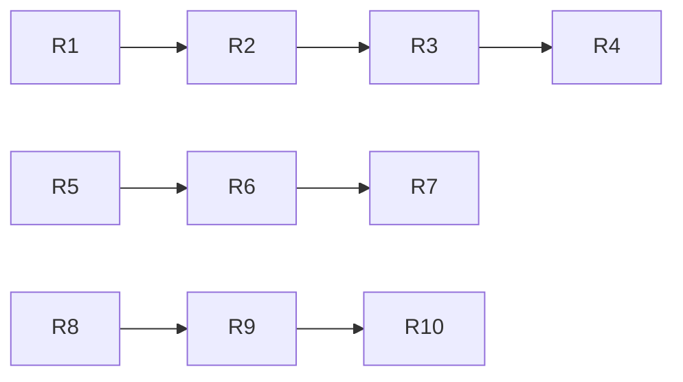

# Risk Analysis

## 1. Identified Risks

| Risk ID | Risk Description | Likelihood | Impact | Mitigation Strategy | Contingency Plan |
|---------|------------------|------------|--------|---------------------|------------------|
| R1 | **Multi-tenant data leakage** – incorrect tenant scoping | Medium | Critical | Automated tests verify `schoolId` scoping on every query; RLS policies in PostgreSQL | Immediate rollback + manual DB audit |
| R2 | **Authentication bypass** – JWT tampering or replay | Low | Critical | Short-lived JWT (1h), HttpOnly cookie, server-side signature verification, CSP | Rotate signing key, force re-login |
| R3 | **Performance regression** – N+1 queries, slow DB | High | High | React Query caching, Prisma batch loading, DB indexes, k6 load tests | Deploy read replica, add caching layer |
| R4 | **File upload abuse** – malicious file types, DoS | Medium | High | VirusTotal scan, MIME whitelist, 10MB limit, signed URLs, rate limit | Disable uploads, alert security team |
| R5 | **Third-party dependency vulnerability** | Medium | High | Dependabot alerts, weekly `npm audit`, lockfile verification | Patch within 48h, hotfix deploy |
| R6 | **Regulatory non-compliance** (GDPR, FERPA) | Low | Critical | Data retention policies, subject access request API, DPA with vendors | Legal review quarterly; remediation sprint |
| R7 | **Vendor lock-in** (Vercel, NeonDB) | Low | Medium | Abstract provider logic in services; migration scripts tested | Canary deploy to alternative provider |
| R8 | **Scalability bottleneck** – single DB for all tenants | Medium | High | Monitor tenant growth; schema-per-tenant migration path ready | Horizontal sharding or dedicated DB per tenant |
| R9 | **Developer onboarding risk** – complex architecture | Medium | Medium | Comprehensive docs, pair programming, onboarding checklist | Dedicated onboarding sprint |
| R10 | **Change management failure** – breaking changes without migration | Low | High | ADR process, semantic versioning, deprecation policy (2 releases) | Emergency hotfix with migration script |

## 2. Risk Matrix Visualization

## 3. Monitoring & Review
- **Weekly**: Review open risks in sprint retrospective.
- **Monthly**: Update risk register, reassess likelihood/impact.
- **Quarterly**: Independent security audit; update risk scores.

## 4. Decision Criteria
- Risks rated **Critical** must be addressed before next release.
- Risks rated **High** must have mitigation in next sprint.
- Risks rated **Medium/Low** tracked in backlog.