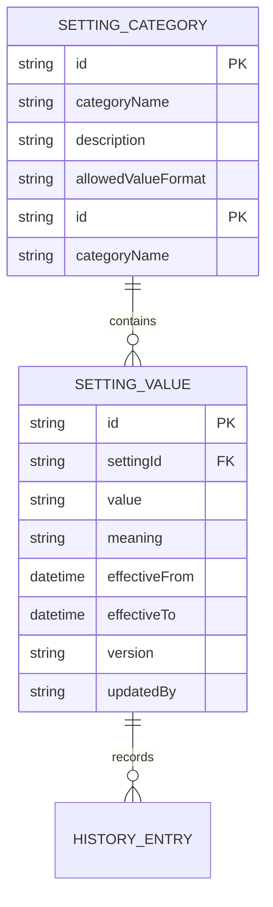

# Settings Module Specification

## 1. Purpose
Manage global SaaS configuration settings that govern multi-tenant system behavior, academic operations, branding, security, and integration parameters. Ensure consistent configuration across all school tenants.

## 2. Scope
This module governs all configurable system parameters that impact operational behavior, compliance, and service delivery across all tenant schools.

## 3. Features
- School Settings configuration
- Academic Session management
- Multi-year Academic Year definitions
- Class and Section hierarchy
- Subject and Department catalog
- Fee structure configuration parameters
- Attendance rules engine
- Exam pattern and grading scheme
- Grading rules engine
- Notification channel configuration
- Email and WhatsApp template management
- Branding controls (theme, logo, colors)
- System-wide Language settings
- Timezone configuration
- Currency settings
- Password policy enforcement
- Security configuration controls
- Backup settings and scheduling
- Integration configuration
- Future ERP connector parameters

## 4. User Flows
### Super Admin Flow
1. Access system configuration dashboard
2. Navigate to desired settings category
3. Review current configuration values
4. Modify settings as needed
5. Save changes with version control
6. Approve changes for deployment
7. Schedule implementation for next maintenance window
8. Verify configuration across environments

### Administrator Flow
1. Configure school-specific settings
2. Set academic calendar parameters
3. Manage fee scheduling rules
4. Set attendance policies
5. Configure exam and grading rules
6. Set notification preferences
7. Adjust system-wide security settings

### Faculty/Administrative Flow
1. View system-wide configuration
2. Check attendance policy enforcement rules
3. View grading scheme settings
5. Access reporting parameters

## 6. Business Rules
- Settings can only be modified by Super Admin or delegated Admin role
- Critical settings require dual approval (Principal + Super Admin)
- Configuration changes take effect after scheduled deployment window
- Academic Year cannot be edited in active payroll cycles
- Security settings stricter than academic settings
- Backup settings immutable after initial configuration
- Language changes require re-authentication
- Database schema changes require migration plan

## 7. Validation Rules
- Configuration ID format: `SET-{SETTING_TYPE}-{VALUE_ID}`
- Parameter names validated against allowed list per category
- Numeric values within business-defined ranges
- Date formats ISO 8601 compliant
- Boolean values strictly true/false
- Category filters enforce allowed scopes (school vs global)
- Audit logs captured for all configuration changes
- Version history maintained with rollback capability

## 8. Database Entities (Conceptual)

## 8. API Endpoints

| Method | Path | Auth | Description |
|--------|------|------|-------------|
| GET | `/api/v1/settings/categories` | ✅ (Super Admin) | List setting categories |
| GET | `/api/v1/settings/categories/{id}` | ✅ (Super Admin) | Get category details |
| PUT | `/api/v1/settings/categories/{id}` | ✅ (Super Admin) | Update category metadata |
| GET | `/api/v1/settings/values` | ✅ (Super Admin) | List all setting values |
| PUT | `/api/v1/settings/values/{id}` | ✅ (Super Admin) | Update setting value |
| POST | `/api/v1/settings/history` | ✅ (Super Admin) | Add version history entry |
| DELETE | `/api/v1/settings/{id}` | ✅ (Super Admin) | Archive setting value |

## 9. Permissions

| Role | Configure Categories | Modify Values | View Audit Logs | Approve Changes |
|------|----------------------|---------------|------------------|------------------|
| Super Admin | ✅ | ✅ | ✅ | ✅ |
| Principal | ❌ | ❌ | ✅ | ❌ |
| Admin | ❌ | ❌ | ❌ | ❌ |
| Faculty | ❌ | ❌ | ❌ | ❌ |

## 10. Notifications
- **Settings Modified**: Change summary sent to Super Admin
- **Audit Trail Update**: Summary appended to change logs
- **Configuration Backup**: Notification upon backup completion
- **Configuration Error**: Deploys send alert to monitoring system

## 11. Reports
- **Configuration Audit Report**
- **Setting Change History Report**
- **System Configuration Status Report**
- **Compliance Verification Report**
- **Backup Schedule Report**
- **Change Impact Analysis Report**

## 12. Edge Cases
- **Concurrent Edits**: Concurrent changes merge with conflict resolution
- **Version Rollback**: Prior valid version restored on conflict
- **Tenant Isolation**: Settings applied per-tenant or globally as defined
- **Grace Period**: Configuration changes delay enforced by safety window
- **Default Values**: Fallback settings used when invalid values provided
- **Validation Overrides**: Last-minute validation prevents prohibited values
- **Version Migration**: Template migration scripts executed safely

## 13. Security Considerations
- Configuration backup encrypted at rest
- Audit logs immutable and tamper-evident
- Configuration changes require audit trail
- Role-based access to configuration endpoints
- Database-level encryption for sensitive settings
- Configuration export requires dual approval for critical parameters

## 14. Performance Considerations
- Backup settings: Daily incremental, weekly full
- Configuration retrieval: < 100ms response time
- Setting changes: 2-phase commit pattern
- Audit log processing: Near real-time (< 1s latency)
- Cache layer for frequently accessed settings values

## 15. Future Enhancements
- AI-powered configuration recommendations
- Automated conflict resolution engine
- Integration with configuration-as-code repository
- Real-time usage-based configuration optimization
- Suggested backup restoration scenarios
- Change impact simulation before deployment

## 16. Cross References
- **Constitution**: Branding & UI Consistency, Security, Multi-Tenant Architecture
- **System Design**: Configuration management architecture
- **Repository Management**: Version control policies
- **CI/CD**: Deployment pipeline triggers
- **Access Control**: Permission hierarchy
- **Database Standards**: Schema versioning
- **API Standards**: Versioning and error handling