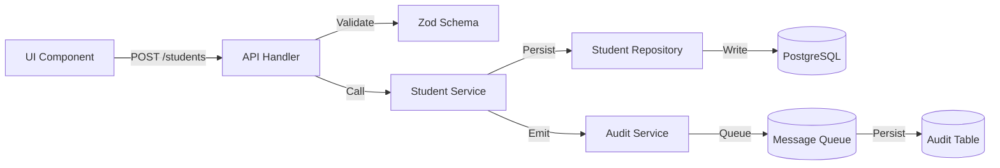

# Detailed System Design

## 1. Layered Structure
```
src/
├─ app/                 # Next.js app router (pages, layouts)
├─ features/            # Feature-centric modules (auth, student, fee, …)
│   ├─ auth/
│   │   ├─ api/         # Route Handlers (REST)
│   │   ├─ components/
│   │   ├─ hooks/
│   │   └─ domain/      # Business rules, DTOs
│   └─ … (other modules)
├─ services/            # Cross-cutting services (email, storage, logging)
├─ repositories/        # Prisma repositories, tenant-scoped
├─ middleware/          # Tenant, auth, rate-limit, error handling
├─ lib/                 # Utilities (date, uuid, logger)
└─ config/              # Environment config, feature flags
```

## 2. Request Flow (Example: Create Student)
1. **UI** – Form submit → `POST /api/v1/students`.
2. **Edge Middleware** – Authenticate JWT, inject `schoolId`.
3. **API Layer** – Validate payload with Zod (`CreateStudentSchema`).
4. **Domain Service** – `StudentService.create(payload, schoolId)`.
5. **Repository** – `studentRepo.create({ …payload, schoolId })`.
6. **Audit Log** – `auditLog.enqueue('student.created', {...})`.
7. **Response** – Return created student DTO.

## 3. Data Flow Diagrams (Mermaid)


## 4. Error Handling Strategy
- **Domain Errors** → Custom `AppError` with `code`, `message`, `httpStatus`.
- **Validation Errors** → 400 Bad Request, error body `{ code: 'VALIDATION_ERROR', details: [...] }`.
- **Auth Errors** → 401 Unauthorized / 403 Forbidden.
- **Unhandled Exceptions** → 500 Internal Server Error; logged, never leak stack traces.

## 5. Logging
- **Structured JSON logs** (`timestamp`, `level`, `service`, `message`, `traceId`).
- **Log Levels** – `error`, `warn`, `info`, `debug`.
- **Log Aggregation** – Sent to Vercel Log Drain → Elastic/Datadog.

## 6. Performance Optimisation Techniques
- **Server-Side Rendering (SSR) + Server Components** for SEO-critical pages.
- **Edge Caching** – Vercel CDN caches static assets for 5 minutes.
- **Database Indexes** – All foreign keys, filterable columns (`school_id`, `status`, `date`) indexed.
- **Pagination** – Limit ≤ 100 to bound DB work.
- **Lazy Loading** – Heavy UI components (charts) loaded on demand.
- **Image Optimization** – Next.js `next/image` with WebP, automatic resizing.
- **Cache Invalidation** – In-memory cache (React Query) with stale-time 5 minutes.